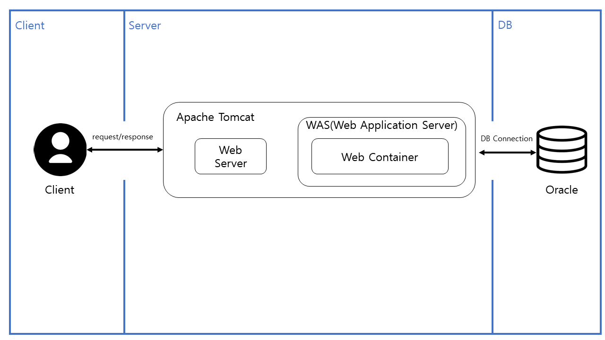

<a name="top">
  
# movie
  
</a>

## 목차
#### [1. 프로젝트 설명](#about_project)
#### [2. movie 기능](#functions)
#### [3. 아키텍처](#architecture)
#### [4. 데모영상](#demo_video)
#### [5. 문서 링크](#docs_link)
#### [6. Docker](#docker)

 

<a name="about_project">  
  
### 1. 프로젝트 설명
  
</a>

##### 1-1. 프로젝트 기획

 > 영화표 예매를 위한 웹사이트

##### 1-2. 프로젝트 목적
 - Servlet&JSP 수행과정 이해
 - 사용자 요청을 MVC 패턴으로 처리 이해
 - Ibatis 프레임워크 사용 이해

[맨 위로 가기](#top)

<a name="about_project">  
  
### 2. movie 기능
  
</a>

 - 영화표 예매
 - 로그인/회원가입
 - 영화 상영 관리(추가/제거)
 - 영화 상영일정 관리(추가/제거)  
...
  
[맨 위로 가기](#top)
 

<a name="about_project">  
  
### 3. 아키텍처
  
</a>

  

**기술 스택**
* Java + Javascript
* HTML/CSS + Bootstrap + JQuery
* Servlet&JSP + Apache Tomcat
* Oracle
* Ibatis
* Junit
* Log4j
  
[맨 위로 가기](#top)
 

<a name="about_project">  
  
### 4. 데모영상
  
</a>

<iframe width="560" height="315" src="https://www.youtube.com/embed/Y2TWfRUFJyc" title="YouTube video player" frameborder="0" allow="accelerometer; autoplay; clipboard-write; encrypted-media; gyroscope; picture-in-picture" allowfullscreen></iframe>

[맨 위로 가기](#top)
 
